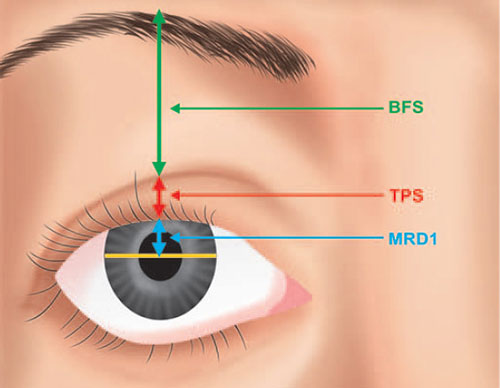
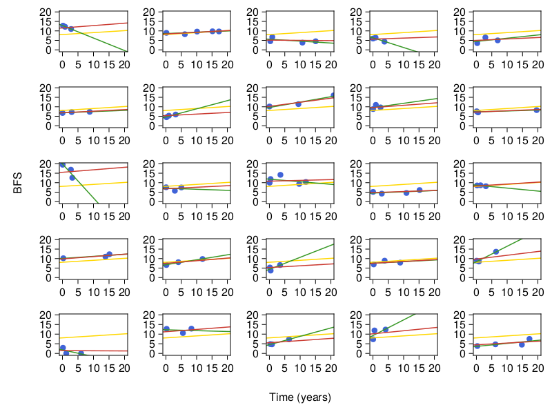

# blepharoplasty

<p align="center"></p>

## Getting started 
```julia
julia> ]
pkg> activate .
pkg> instantiate
```
## Required data
    data
    └── bleph-cw-v2.xlsx 

## Example result
<p align="center"></p>
<br>

**Figure 1:** Long-term increase in BFS over time after blepharoplasty. Y-axis shows BFS measurements with standardized limbus-to-limbus distance of 11 mm. X-axis shows the number of years spanned from blepharoplasty. Each plot corresponds to data from one individual with data shown for total 25 individuals. The green line shows the fitted linear model from just using the measurements from each individual. The gold line shows fitted linear model from using all measurements from all individuals without considering possible correlation among measurements from the same individuals. The red line shows fitted linear mixed models with random intercept and slope terms or the best linear unbiased predictor (BLUP) estimates.

## References
- R.A. Goldberg: **Cosmetic ptosis surgery in children** (2018) ([link](https://youtu.be/tLZEgNUKvlc?si=zZEtpfil2IvKJajy))
